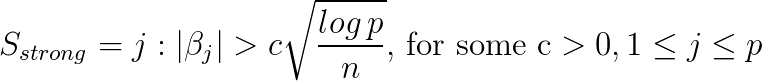
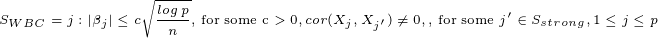
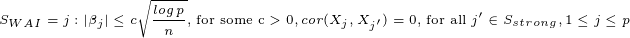

# P8160 Project 1: Variable Selection Simulation Study

## Introduction

Variable selection is commonly done to choose a subset of predictors for regression problems in high-dimensional settings. While variable selection methods strive to strike a balance between model fitness and complexity, they often struggle with the problem of "weak" predictors, predictors that are small, but still significant to a true relationship with the response. Li et. al performed a simulation study using a new method to try to be more inclusive of these weak predictors. Li's group demonstrated that incorporating these weak signals improved estimation and prediction performance.  

This study is motivated by a converse idea: if Li's findings suggest that incorporating weak signals improves a model, then it is of interest to investigate how well variable selection methods find these signals and what happens if they are excluded.

Thus, we sought to answer two main questions: 

1) How well do variable selection methods pick up on weak signals? 
2) What happens to coefficient estimates if they are missed?

We attempt to answer these questions using simulations. The variable selection methods of interest are forward selection and LASSO. 

## Important Definitions

Li et. al defines "strong" and "weak" predictors in the following way:

Strong:

Weak But Correlated (WBC):

Weak And Independent (WAI):

where **n** is the number of observations, **p** is the number of predictors, and **c** is an arbitrary threshold multiplier.

*Weak but correlated* and *weak and independent* predictors are distinguished here since LASSO is known to be indifferent to correlated predictors. 

## Scenarios to Investigate

With so many variables to manange, we decided to fix the following variables to make the simulations more manageable. 

* Number of strong predictors: 5
* Number of WAI predictors: 10
* Number of WBC predictors: 10
* Coefficient of strong predictors: 5
* Correlation between WBC and strong predictor: 0.30
* Number of simulations for each scenario: 100

Fixing the number of strong and weak predictors makes it easier to ensure that the weak predictors have an appreciable contribution as a whole to the response. The number of simulations was decided based on a formula suggested by Burton et. al and raised to a convenient number.

For both questions, we simulated a dataset from a multivariate normal after creating a variance-covariance matrix that fit our needs. We then appended a response variable Y that was a function of the strong and weak parameters for the variable selection methods to regress on. Each question was explored by varying different aspects of the simulation, specified below:

### First Question

In order to figure out how well the variable selection methods fare in detecting weak signals, we varied how many null predictors were included in the dataset (p) and the threshold multiplier (c). To get a range of low-dimensional to high-dimensional (relatively speaking), we performed simulations for p = 30 (5 null predictors) to 90 (65 nulls) in intervals of 10. For the threshold multiplier, we varied it between 1, 2 and 3, a combination ascertained from sensitivity analysis. 

After the selection methods produce a set of best covariate, we measured how many of the original strong and weak predictors were actually retained. 

### Second Question

To see how missing weak parameters affected coefficient estimates, an extra step was included before the data was fed into the models. These simulations varied by the amount of weak predictors that were forced out of the data before the model could regress on it. By forcing out weak predictors, it emulates these models "missing" these predictors. 

We looked at the difference between the coefficient estimates and the known true value to get a sense of how missing weak predictors affected these biases.

## Findings

