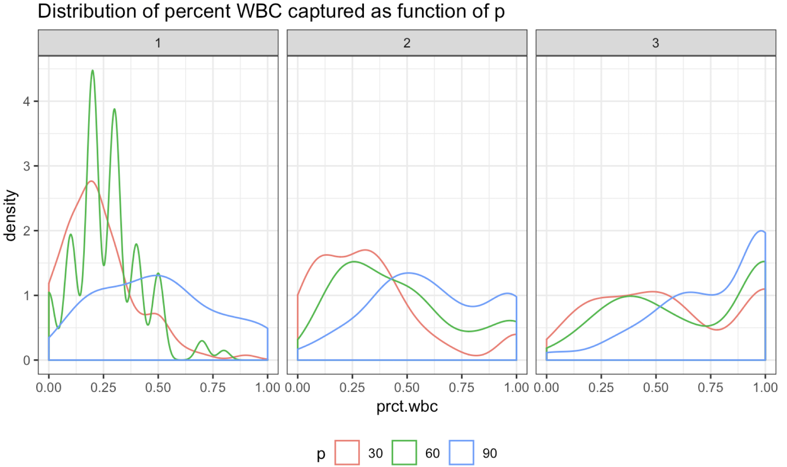
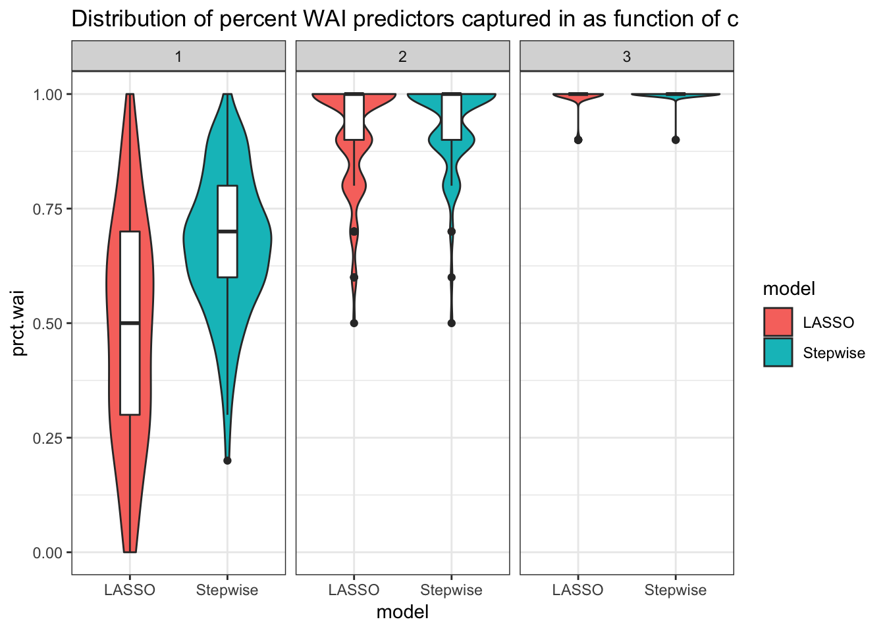
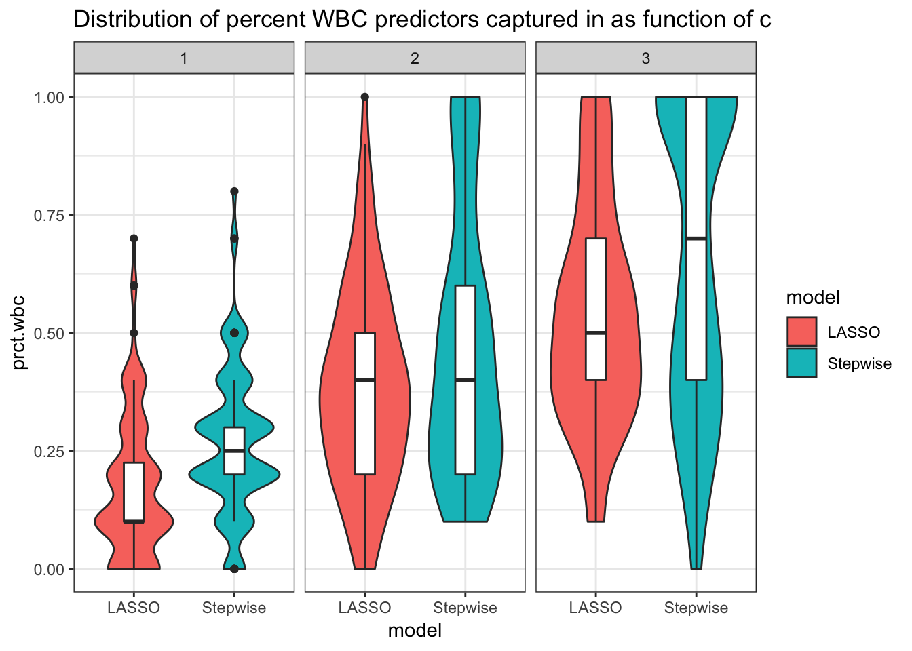
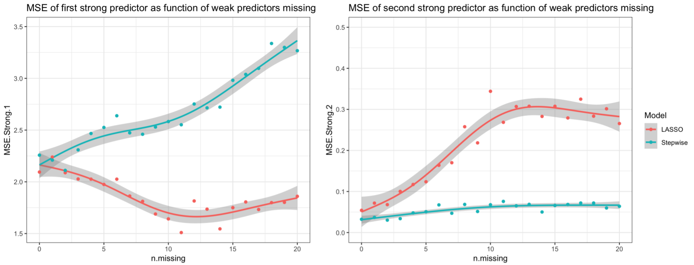

# Objectives

Variable selection methods involve choosing of covariates for a model through an automatic optimization process. These algorithms are useful in high-dimensional settings, where we may need help selecting predictors that strike a balance between fitness and complexity. Some selection algorithms use a pre-specified criterion such as the AIC or Mallow’s $C_p$ and iteratively add predictors to a null model until some threshold is reached. Others involve minimizing a loss function that involves an extra regularization term to shrink coefficient number or magnitude, such as LASSO or Ridge Regression. These algorithms seek to strike a balance between model complexity and predictive ability.

A problem that plagues variable selection procedures is the presence of weak predictors - small, but non-zero coefficients. Weak predictors are often excluded by variable selection to the detriment of the model. Li et. al performed a simulation study using a new method to try to be more inclusive of these weak predictors, showing that their inclusion benefits estimation and predictive ability. [1] Different selection procedures perform differently in their ability to detect these weak signals, which merits investigation. 

# Statistical methods to be studied 

This report seeks to evaluate how different variable selection methods capture weak signals and investigate how their exclusion affects parameter estimations using simulation. Stepwise forward regression and automated LASSO regression will be the methods of interest.

The stepwise forward method starts with the null model and adds predictors that maximize the reduction of a given criteria. For this report, the criterion of interest will be Akaike’s Information Criterion (AIC), defined as follows:

$$AIC = n \, ln \bigg( \sum^n_{i=1} (y_i - \bar{y}_i)^2 / n) + 2p  \bigg)$$

Automated LASSO regression seeks to minimize model coefficient magnitude and eliminate non-significant predictors. LASSO uses the following penalized loss function to optimize the model coefficients:

$$min  \frac{1}{2n} \sum^n_{i=1} (y_i - x_i\beta)^2 + \lambda \sum^p_{k=1} |\beta_k|$$

# Scenarios to be investigated 

We’d like to investigate how well our variable selection methods pick up on weak signals. In order to simplify the scope of our simulations, we’ve decided to fix the number of strong, WBC, and WAI signals to 5, 10 and 10 respectively. This particular ordering ensures that the ratio of weak to strong signals is high, ensuring that the collective contribution of these weak signals to the response is significant. 

Furthermore, we fix the number of observations in each simulated dataset to be 100. The choice of coefficient for strong signals was chosen to be 5, well above the threshold that defines weak signals. 

Using a formula from Burton et al., we calculated the required number of simulations needed to estimate each of our coefficients within 5% with 95% confidence level. [2] Using these constraints, along with the standard error from a single simulation for strong coefficents, we calculated a satisfactory number to be 100 simulations. 

## Task 1: 

For this task, we will vary the amount of null of predictors that are contained in the dataset and the threshold multiplier value $c$. We will run simulations for $p$ = 30, 40, 50, 60, 70, 80, 90 and for $c$ = 1, 2, and 3. This scope of parameter numbers gives us a simulations for both low-dimensional and high-dimensional data situations. Allowing $c$ to vary by small amounts will allow us to see how raising the threshold of values that weak predictors can take affects how they are discovered. After passing our simulated data to both LASSO and forward selection, we can then compare how well each method captures weak predictors.

## Task 2

We’ve previously specified that our simulations will have a fixed amount of weak predictors: 10 WBC and 10 WAI. In order to assess the effects of missing weak predictors on parameter estimates, our scenario here will involve iteratively removing a weak predictor from the data before feeding it into LASSO or forward selection. This exclusion will effectively force the variable selection to "miss" these predictors. Thus, each simulation will produce an estimate for each coefficient as a function number of weak predictors missing from the data. 

# Data Generation Methods

We distinguish between 4 types of signals in our generated data: strong, weak and correlated (WBC), weak and independent (WAI), and null signals, defined as follows:

## Strong

$$S_{strong} = {j: |\beta_j| > c\sqrt{\frac{log \, (p)}{n}} \text{, for some c} > 0, 1 \leq j \leq p}$$

## Weak but correlated

$$S_{WBC} = j: |\beta_j| \leq c\sqrt{\frac{log \, (p)}{n}}\text{, for some c > 0}, corr(X_j, X_j’) \neq 0, \text{for some j’ in } S_{strong}, 1 \leq j \leq p$$

## Weak and independent

$$S_{WBC} = j: |\beta_j| \leq c\sqrt{\frac{log \, (p)}{n}}\text{, for some c > 0}, corr(X_j, X_j’) = 0, \text{for some j’ in } S_{strong}, 1 \leq j \leq p$$

## Null

$$S_{null} = {j: \beta_j = 0, 1 \leq j \leq p}$$

We first generated a variance-covariance matrix with preset correlations to ensure that each predictor satisified the above definitions. We chose a correlation $corr(X_j, X_{j'}) = 0.30$ between all the WBC predictors and the first strong predictor. This distinction will allow us to see how these correlations may affect biases in Task 2. After confirming that this matrix was positive and definite, we fed it into a multivariate normal random number generator. An output $Y$ was generated as a function of strong, WBC and WAI predictors with coefficients satisfying the type definitions. 

# Performance measures

## Task 1

It is fairly easy to track which strong and weak predictors are included by the variable selection methods since they have a fixed number. The performance measure for this task will be a calculation of the percentage of incorporated strong, WBC and WAI predictors as both a function of the number of parameters $p$ and threshold multiplier $c$ in the simulated dataset. 

## Task 2

As weak predictors are forced out of the data, we expect that the estimation and standard error for each remaining coefficient will be influenced. Since we know the true value of each strong and weak predictor, we can compare the estimations from LASSO and forward regression against the true value to calculate accuracy as a function of number of weak predictors missing defined as follows. 

Accuracy will be defined in terms of the mean square error of the estimate:

$$MSE  =  (\bar{\beta_{sim}} - \beta)^2$$ 

where $SE(\beta)$ is the standard error of the beta coefficient over all simulation runs. 

# Simulation Results

## Task 1

### Increasing the number of null parameters has minimal effect on weak predictor detection

We found that increasing the amount of null predictors that each variable selection method had to sift through had minimal effect on increasing their ability to detect WBC snd WAI predictors. This small increase in weak predictor detection may be attributable to the increased number of predictors kept by each method as $p$ increased and not to a better detection ability.

Figure 1 demonstrates this trend. From $p = 30$ to $p = 90$, the distribution of WBC predictors detected improves only slightly in forward selection. A similar trend was seen in LASSO, suggesting that this effect is agnostic to selection method. There seems to be some interdependence of the number of parameters $p$ and the threshold multiplier $c$, as seen in the shift in densities through increasing values of $c$. In fact, we found that varying $c$ improved each selection method's ability to detect weak predictors markedly. 

### WAI predictors are easier to detect than WBC predictors

Figure 2 illustrates that increasing $c$ has a large effect on a variable selection method's ability to recognize weak predictors, espeically when they are independent of the strong predictors. This result makes sense since increasing $c$ allows weak predictors to take on higher values, making them easier to distinguish from random noise. 

This increase in detection ability is slightly hampered when the weak predictors are also correlated with a strong predictor, as seen in Figure 3. A large spread of percentages suggests that correlation still makes it difficult, but the increasing means illustrate that there is improvement.

## Task 2

### Missing weak predictors decreases accuracy in strong predictor estimates, but this depends on correlation

As stated before, only the first strong predictor had been correlated to all the WBC predictors. Consequently, the other 4 strong predictors are not correlated with any of the weak preditors. Figure 5 illustrates an interesting relationship between the number of missing weak predictors and how bias changes. When the strong predictor is correlated to some of the weak predictors, bias increases faster  in forward selection compared to LASSO. However, this relationship is reversed when the strong predictor is not correlated with weak predictors. This result is expected since LASSO is indifferent to correlated predictors, but still introduces some bias into the model.

We also observed that the rise in MSE for the second strong predictor to level off when 10 weak predictors were missing. This levelling off is explained by the fact that the WAI predictors were iteratively removed from the dataset first. As correlated predictors are removed, their influence has no effect on a predictor that is independent from them. 

## Conclusions

Our simulation study demonstrates that weak predictor detection in variable selection algorithms is a function $c$, where higher $c$ has a greater effect on improving detection. Increasing $p$ has nominal increases to detection, but this is attributable to a tendency of variable selection methods to use more variables as more are available. Forward selection proved to be slightly better than LASSO in detection of weak predictors, especially in the context of WBC predictors. 

The effect of "missing" weak predictors on strong predictor coefficient estimates depends on the presence of correlation between the strong and weak predictors. If correlations exist, the simulations showed that removing weak predictors adversely affects forward regression more while LASSO is realtively unaffected; however, if no correlation exists, this relationship reverses.

Our findings are limited by the amount of simulations we produced and the scope our chosen constants and scnearios for the simulations. Given how the presence or absence of correlation affects the accuracy of estimates, it is worth investigating further how magnitude of correlation and different numbers of correlated weak predictors affects estimates. 

# References

1. Li Y, Hong HG, Ahmed SE, Li Y. Weak signals in high‐dimensional regression: Detection, estimation and prediction. Appl Stochastic Models Bus Ind. 2018;1–16. https://doi.org/10.1002/asmb.2340
2. Burton, A. , Altman, D. G., Royston, P. and Holder, R. L. (2006), The design of simulation studies in medical statistics. Statist. Med., 25: 4279-4292. doi:10.1002/sim.2673

```{r, out.width = "300px", fig.align="center", echo = FALSE, fig.cap = "Percent of WBC predictors detected as a function of p and c with forward selection" }

```

```{r, out.width = "300px", fig.align="center", echo = FALSE, fig.cap = "Detection of WAI predictors increases greatly with higher c" }

```

```{r, out.width = "300px", fig.align="center", echo = FALSE, fig.cap = "Detection of WBC predictors increases with c, but still maintains a wide distribution across simulations" }

```

```{r, out.width = "400px", fig.align="center", echo = FALSE, fig.cap = "Accuracy decreases more in forward selection when the strong predictor is correlated with weak predictors, but vice-versa when it is not" }

```